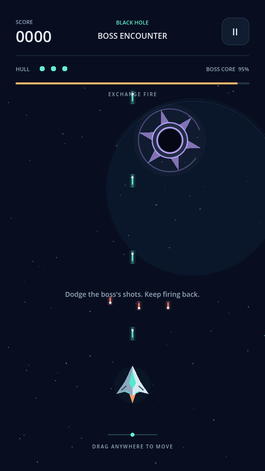
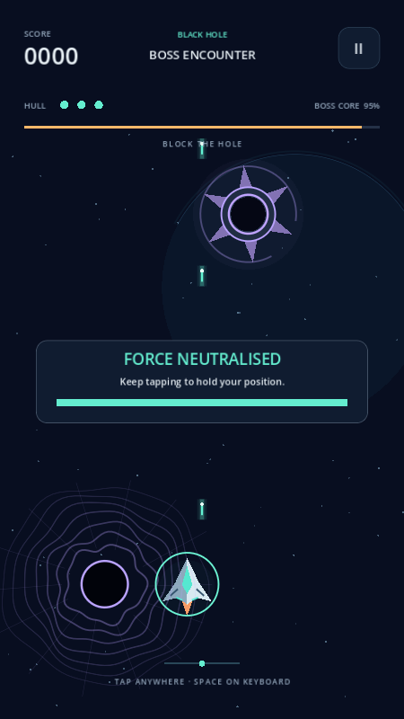
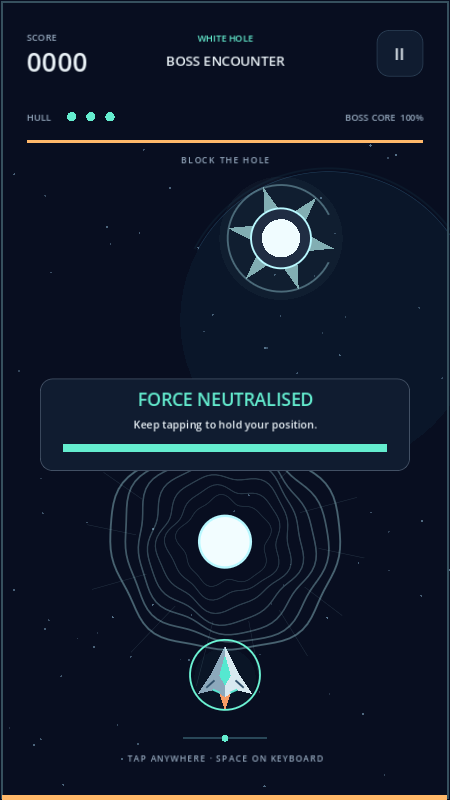

# Alien Invasion

A space shooter that began as a Python/Pygame practice project and is being developed into a portrait mobile game with Godot.

The current Godot prototype has four selectable encounters: the original alien fleet and three bosses. It runs locally on desktop and supports touch input. Phone builds and store submission are the next development stage.

## Play the Godot game

Install **Godot 4.7**; development and local checks use **4.7.2**.

1. Open `mobile/project.godot` in Godot.
2. Press **F5**.
3. Choose an encounter and select **Launch mission**.

On macOS, you can also double-click [`mobile/Play.command`](mobile/Play.command). The launcher imports the project on its first run and starts the game. On any platform with the Godot CLI installed:

```sh
godot --headless --path mobile --editor --import --quit
godot --path mobile
```

### Controls

| Input | Steering | Block a hole | Pause |
| --- | --- | --- | --- |
| Touch | Drag horizontally | Tap repeatedly | Pause button |
| Mouse | Click and drag | Click repeatedly | Pause button |
| Keyboard | Arrow keys or A/D | Press Space repeatedly | P or Esc |

Weapons fire automatically. During a hole attack, tapping temporarily replaces steering. Holding a button does not count as repeated taps.

Each tap fully cancels a hole's force for a brief beat. Keep tapping to hold the ship exactly where it is. Tapping never pushes the ship away and never recovers distance already lost; when the tap window expires, the pull or push returns at full strength.

## Boss fights

**Exchange fire → randomly timed special attack → survive → exchange fire again.** This cycle repeats until the boss has no health left. Only player shots hitting the boss damage it. Surviving an attack does not reduce its health, and health never resets between cycles.

- **Black hole:** a hole opens next to the ship. Repeated taps neutralise the pull. Being pulled into its core ends the run.
- **White hole:** it forms on the opposite side from the ship's nearest screen edge and pushes toward that edge. All four edges count, so the hole usually forms above the ship and pushes down. Repeated taps neutralise the push; reaching an edge destroys the ship.
- **Asteroid forge:** the boss throws a finite barrage of rocks. Dodge them or shoot each one twice. Once the barrage is cleared, the firefight resumes.

Each boss shoots aimed volleys during normal combat and uses its own special after a random interval, with a visible warning. The fleet encounter has 15 enemies and three lives.





The game includes pause on focus loss, hit effects, synthesized sound, and a separate local best score for each encounter. There are no accounts, ads, analytics, or network requests in the game.

## Project structure

```text
mobile/
  project.godot       Godot project entry point
  main.tscn           Main scene
  scripts/            Game rules, actors, bosses, UI, saves, and sound
  tests/              Gameplay, input-routing, and boss-cycle checks
  Play.command        Mac launcher
docs/screenshots/     Actual Godot screenshots
*.py                 Original Python/Pygame game
images/              Original Python artwork
```

See [the Godot project guide](mobile/README.md) for the code map, tuning notes, and mobile export requirements. Open `alien-invasion.code-workspace` in VS Code or Cursor to work with the complete repository.

## Run the checks

Use disposable save files so tests do not overwrite your flight records:

```sh
ALIEN_SAVE_PATH=/tmp/alien-smoke-record.cfg godot --headless --path mobile --script tests/smoke.gd
ALIEN_SAVE_PATH=/tmp/alien-input-record.cfg godot --headless --path mobile --script tests/input_flow.gd
ALIEN_SAVE_PATH=/tmp/alien-boss-cycle-record.cfg godot --headless --path mobile --script tests/boss_cycle.gd
ALIEN_SAVE_PATH=/tmp/alien-hole-physics-record.cfg godot --headless --path mobile --script tests/hole_physics.gd
```

Checks cover scoring, lives, restart, saves, pause, touch ownership, GUI input, swept collisions, hole neutralisation and failure, destructible asteroids, repeated boss cycles, and projectile-only boss damage.

## Run the original Python game

From the repository root, create a virtual environment, install `requirements.txt`, and run:

```sh
python -m pip install -r requirements.txt
python alien_invasion.py
```

Use the left/right arrow keys to move, Space to shoot, and Q to exit. The original practice version remains available alongside the Godot project.

## Release status

This is a playable development prototype, not a signed Android/iOS release. It has been checked locally on macOS; physical-phone testing, final artwork, campaign progression, export configuration, signing, and store submission remain. The Godot prototype uses original procedural graphics and synthesized sounds; original Python artwork is not bundled into the Godot game.
