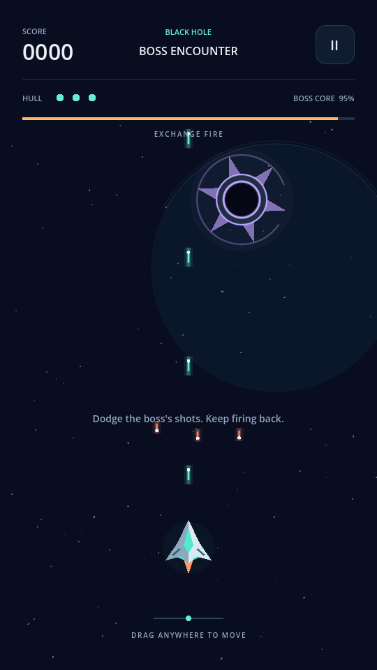
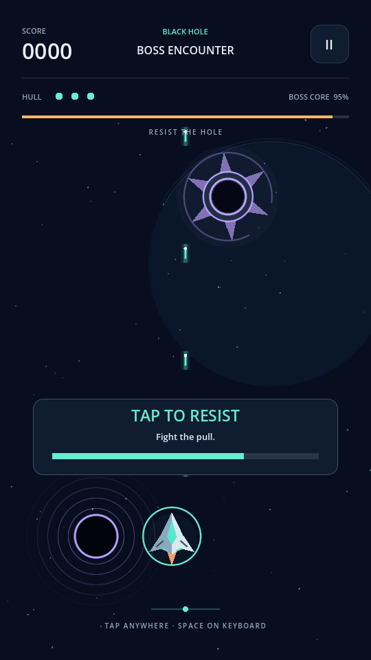
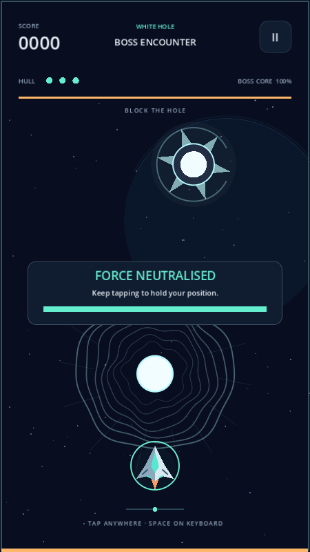

# Alien Invasion

A space shooter that began as a Python/Pygame practice project and is being developed into a portrait mobile game with Godot.

The current Godot prototype is an endless high-score shooter with random alien groups, drifting asteroids, and three bosses. It runs locally on desktop and supports touch input. iOS development and Android debug APK presets are included; store submission remains future work.

For the prepared local phone builds, see [iPhone installation instructions](INSTALL-ON-IPHONE.md). The iPhone installer resolves paths relative to this folder, including after moving the project.

## Play the Godot game

Install **Godot 4.7**; development and local checks use **4.7.2**.

1. Open `mobile/project.godot` in Godot.
2. Press **F5**.
3. Select **Launch endless flight**.

On macOS, you can also double-click [`mobile/Play.command`](mobile/Play.command). The launcher imports the project on its first run and starts the game. On any platform with the Godot CLI installed:

```sh
godot --headless --path mobile --editor --import --quit
godot --path mobile
```

### Controls

| Input | Steering | Block a hole | Pause |
| --- | --- | --- | --- |
| Touch | Drag horizontally | Tap repeatedly | Pause button |
| Mouse | Click and drag | Click repeatedly | Pause button |
| Keyboard | Arrow keys or A/D | Press Space repeatedly | P or Esc |

Weapons fire only while holding or dragging the lower flight area; release to stop firing. During a hole attack, tapping temporarily replaces steering. Holding a button does not count as repeated taps.

Each tap fully cancels a hole's force for a brief beat. Keep tapping to hold the ship exactly where it is. Tapping never pushes the ship away and never recovers distance already lost; when the tap window expires, the pull or push returns at full strength.

## Boss fights

**Exchange fire → randomly timed special attack → survive → exchange fire again.** This cycle repeats until the boss has no health left. Player weapons and player-redirected rocks damage the boss, and only after all surrounding alien guards are destroyed. Surviving an attack does not reduce its health, and health never resets between cycles.

- **Black hole:** the boss fires a fast rift cannon that folds space, detonates in the lower-middle playfield with a clearance check, and creates the hole. Repeated taps neutralise the pull. Being pulled into its core is lethal without a collected shield.
- **White hole:** the boss fires its rift cannon into a fixed lower-middle area. The blast creates a white hole that pushes away from its core, usually downward. All four edges remain dangerous. Repeated taps neutralise the push; reaching an edge destroys the ship.
- **Asteroid forge:** space-fold strands connect the boss to rocks offscreen, pulling them inward before a brief wind-up and sling toward the ship. The strands fade after release. Small, medium, and large asteroids take 5, 8, and 12 shots initially to destroy. Once the barrage is cleared, the firefight resumes.


Random enemy groups and asteroids keep arriving between bosses. About 45% of regular aliens zigzag, and alien firing uses a 1.05–1.9-second reference divided by the current difficulty scale. Boss music gives a three-second warning before an entrance, roughly every 40–55 seconds of regular flight. Each set of three bosses contains all three types in shuffled order. Defeating a boss awards points, drops exactly one special weapon, one gun upgrade and one shield, preserves its unfinished attack, and continues after the hazards expire. The ship returns smoothly to normal position.

## Drops and survival

### Special weapons

- **Gravity:** eligible alien kills charge the button: 10 kills unlock the smallest hole and 50 fill it. Press the button to open a three-second targeting window. A tap-and-release in the safe upper half chooses a destination and starts a one-third-second muzzle charge. Without a selection, the cannon fires automatically at **3 seconds** toward the middle of the upper half; its charge animation plays during the final third-second of that window. Existing steering continues, and new touches in the lower half can steer while targeting. Pressing the button again cancels. Charge is spent only on launch. A single hole lasts **3–7.5 seconds**; charge changes size and duration, never pull strength. Hole absorption and annihilation kills do not recharge it. Pause, death, restart or newly active unshielded gravity cancel a pending shot without spending its bank.
- **Laser:** collect up to 99 charges. Its button selects a ten-second firing budget; lifting the steering finger pauses the clock. Toggle back to the primary guns and resume the same remaining budget later. Expiry restores the previous weapon and never automatically spends another charge.
- **Electron:** collect up to 10 charges from boss rewards or a qualifying large-asteroid family. The beam chains through visible aliens and asteroids; rocks melt without fragments, and a boss takes one cannon-equivalent hit after its guards are gone.
- **Cannons:** start with 30; drops add five, up to 99. Tapping an enemy fires one homing cannon. With at least five in stock, the button launches a volley at visible small aliens, prioritizing those nearest escape. It spends only the available ammunition needed for their health, accounting for cannons already in flight. Both controls share one inventory.

The primary progression is **single → double → triple → enhanced triple plasma**. All primary bullets travel at 850 units/second with a 0.17-second cadence. Normal bullets deal one damage, enhanced plasma two, and cannons three plus splash within 65 pixels. The continuous laser instantly kills small aliens, deals one boss hit per 0.25 seconds, and reflects away from the player when it touches asteroids. It also pushes asteroids, with a stronger effect on small rocks.

Hull lives have a strict maximum of three; health pickups refill them and weapon upgrades grant no backup life. Alien contact destroys the alien with an electrical discharge and costs one life. Unprotected asteroid contact and an escaped alien's homing gravity cannon are instant losses.

Forced gravity tapping automatically supplies a hazard ward that deflects bullets and rocks and zaps nearby small aliens. It does **not** protect from the gravity core or lethal white-hole boundary. A collected ten-second shield also grants gravity immunity, steering and firing, including special weapons. Swarm shields drop at one third the hull-repair rate; bosses always drop a shield. A protected dome zaps a small alien when its silhouette reaches one pixel outside the circumference, before escape or collision can trigger. Unprotected alien rams discharge only on contact and still cost one life. An escaped-alien gravity cannon is absorbed with a harmless outward ripple. Only asteroids redirected by the player’s hole, shield/ward or laser can damage enemies: small aliens die; bosses take one cannon’s damage, respecting their alien guards. Fragments retain this ownership.

Every hole closure requests smooth recovery to the normal cruising **Y** position while retaining X. Recovery waits for all overlapping gravity to end, including when a collected shield is active. Bosses recruit only aliens above the screen midpoint; lower aliens continue forward. Bosses dodge player event horizons with smooth continuous motion and may retreat above or beside the screen. They keep full hull clearance while fields move or merge, then return smoothly when a safe route opens. Their gravity-only distortion shield does not change ordinary weapon damage.

Space folds refract nebulae, planets and nearby solar wind; distant stars stay nearly stationary behind them and are never warped. Black-hole ripples travel inward and white-hole ripples outward; their lit ridges bend the background into an elliptical well. The rift cannon, asteroid tethers, and folded rocks also distort the sky behind them. Ships, bullets, and controls remain sharp above the effect.

The holes now use a detailed accretion texture with animated plasma filaments and bright, irregular inner rims. Player fields are blue; alien fields keep their encounter colour. White holes reverse the flow around a luminous icy core. Hole-specific background displacement is 40% stronger, and active holes retain priority during rapid tap feedback. Rich cyan, violet and magenta nebulae make the background more vibrant while retaining dark space around combat. See the [texture and generation prompt](mobile/assets/effects/README.md).





The game includes pause on focus loss, hit effects, original synthesized sound, and a persistent local endless high score. The rift cannon uses a high-to-low sci-fi blast made in code. There are no accounts, ads, analytics, or network requests in the game.

## Project structure

```text
mobile/
  project.godot       Godot project entry point
  main.tscn           Main scene
  scripts/            Game rules, actors, bosses, UI, saves, and sound
  tests/              Gameplay, input-routing, and boss-cycle checks
  Play.command        Mac launcher
docs/screenshots/     Actual Godot screenshots
*.py                 Original Python/Pygame game
images/              Original Python artwork
```

See [the Godot project guide](mobile/README.md) for the code map, tuning notes, and mobile export requirements. Open `alien-invasion.code-workspace` in VS Code or Cursor to work with the complete repository.

## Run the checks

Use disposable save files so tests do not overwrite your flight records:

```sh
ALIEN_SAVE_PATH=/tmp/alien-smoke-record.cfg godot --headless --path mobile --script tests/smoke.gd
ALIEN_SAVE_PATH=/tmp/alien-input-record.cfg godot --headless --path mobile --script tests/input_flow.gd
ALIEN_SAVE_PATH=/tmp/alien-boss-cycle-record.cfg godot --headless --path mobile --script tests/boss_cycle.gd
ALIEN_SAVE_PATH=/tmp/alien-hole-physics-record.cfg godot --headless --path mobile --script tests/hole_physics.gd
ALIEN_SAVE_PATH=/tmp/alien-endless-record.cfg godot --headless --path mobile --script tests/endless.gd
```

Checks cover scoring, lives, restart, saves, pause, touch ownership, GUI input, swept collisions, hole neutralisation and failure, destructible asteroids, repeated boss cycles, and boss shield damage gates.

## Android test APK

Install the matching Godot Android export templates, a supported Android SDK and JDK, then set their paths and the local debug keystore in Godot's export settings. From the repository root:

```sh
mkdir -p build/android
godot --headless --path mobile --export-debug Android ../build/android/AlienInvasion-debug.apk
```

The `Android` preset targets ARMv7/ARM64 and signs with the local debug key. This is a sideloadable test APK; release signing and a Google Play App Bundle remain separate steps. See [mobile build notes](mobile/README.md#android-test-apk).

## Run the original Python game

From the repository root, create a virtual environment, install `requirements.txt`, and run:

```sh
python -m pip install -r requirements.txt
python alien_invasion.py
```

Use the left/right arrow keys to move, Space to shoot, and Q to exit. The original practice version remains available alongside the Godot project.

## Release status

This is a playable development prototype, not a store release. It has been checked locally on macOS; final artwork, further phone playtesting, difficulty tuning, and store submission remain; iOS development signing is configured. The Godot prototype uses original procedural graphics and synthesized sounds; original Python artwork is not bundled into the Godot game.

Difficulty begins at 1% and rises by one point per boss defeated. It changes enemy firing frequency and drop chances, while movement, wave timing, bullet speeds, and gravity strength stay constant. Small aliens always take 3 normal bullet damage, showing wreckage after one hit and smoke after two. Asteroids begin at 5/8/12 hits by size and gain one hit every two victories. Boss health follows floor(100 - 780 / (12 + victories)): 35, 40, 44, 48… with a 99-hit ceiling. The underlying curve approaches 100 without reaching it. Single/double/triple bullets all travel at 850 units/s with a 0.17-second firing interval. Rockets travel at 660 units/s; the ten-second laser instantly kills aliens, pushes asteroids and reflects away from the player, and deals one boss hit per 0.25 seconds. Original flight music switches to boss music during encounters. Planets drift through the sky and are replaced after passing offscreen.
## Drop progression

Every regular or summoned swarm guarantees a support drop on its first defeated alien. Optional extra drops have a 4% chance at the 50% difficulty reference, capped at 12%, and choose primary upgrades or support: hull repairs, cannon ammunition or shields. Swarms never drop laser/electron weapons.

Every boss drops exactly **one special weapon, one gun upgrade, and one shield**. The special is electron with a 30% chance, otherwise laser. Guaranteed rewards replace the oldest uncollected pickup when the bounded pool is full.

A large asteroid has one additional challenge reward: destroy the original rock and every descendant using only primary gun damage, including enhanced plasma. The final small fragment drops **one** special using the same 30% electron/70% laser roll. Any non-primary damage, swallowed piece, escaped piece or collision removal disqualifies the whole family; unrelated medium/small asteroids do not qualify. Deflection alone does not invalidate it.

Shooting and explosion effects use a low-bass palette. Gravity spawns and boss deaths descend to an 18 Hz sub-bass tail with audible harmonics; a dedicated impact voice prevents gunfire from interrupting them.

## Presentation and code

The game remains 2D. Detailed player and alien sprites have baked armor depth, blue/violet engine plasma, and matching weapon hardpoints. Black-hole particles spiral inward; white holes emit them outward, with spin matching the disk. Gravity taps, shields, tethers and screen edges use soft plasma and background refraction rather than line strokes. White departures always release light, including the edge bubble. Rounded iPhone edges use the safe-area geometry; desktop edges remain square.

Ship deaths begin by folding the textured metal inward. Bullets cause a quick buckle; asteroid and alien impacts crush the hull; black holes draw it into the horizon; white holes compress it against the screen boundary. The following fire explosion, outward fragments and expanding distortion wave remain visible before the menu appears. Black event horizons mask every fragment and fire pixel inside the core. Black-hole engine burn increases strongly with proximity; player engines stay blue. Lighting remains consistent within each sector and changes gradually between sectors.

Merging black holes form a soft liquid neck, swell into two joined lobes, then settle into one larger horizon. Their combined area and remaining lifetime are conserved. The same live core size drives swallowing, projectile contact, laser routing and boss clearance during the merge.

Solar wind is a smooth, faint cloud layer at one tenth the earlier particle brightness. The shield's blurred halo is also reduced to one tenth; its blue hex grid, shifting color and electrical flow remain bright against dark space, with the established distortion intact. Successful weapon-button actions have distinct short haptics that follow the vibration toggle.

See the [code guide](docs/CODE_GUIDE.md) for ownership, tuning and test commands, the [fighter assets](mobile/assets/ships/README.md) for sprites and prompts, and the [gravity assets](mobile/assets/effects/README.md) for accretion textures. Artifacts in `build/` are generated and ignored by Git.
